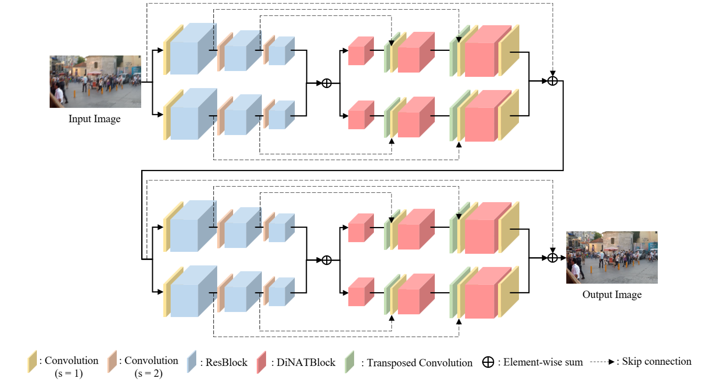
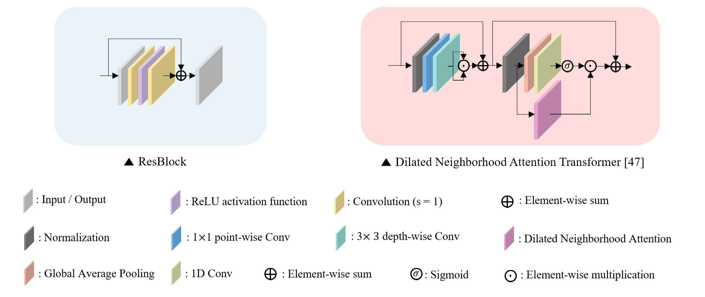
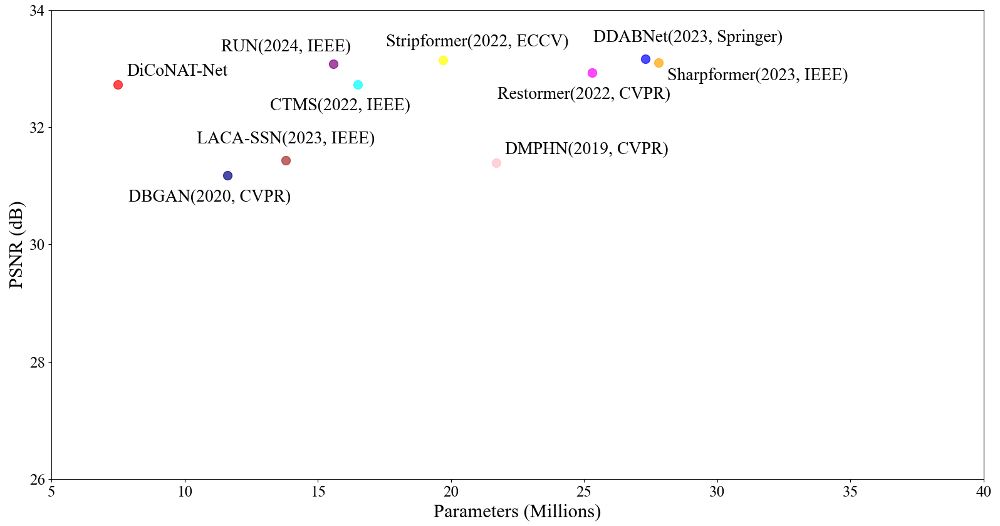
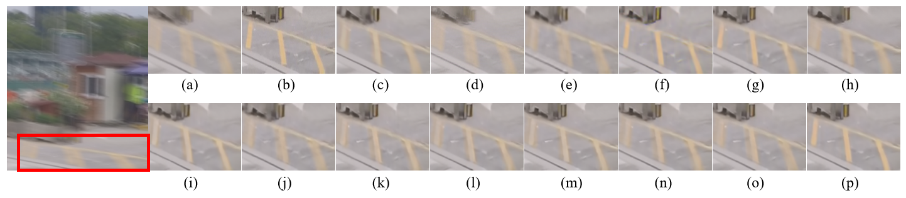
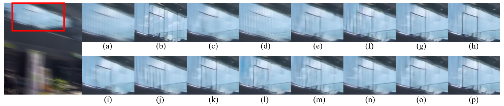
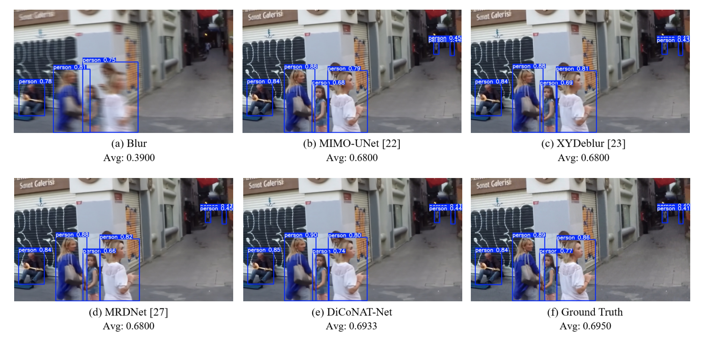

# DiCoNAT-Net

**A Dilated Neighborhood Attention Transformer with Dual-Path Architecture for Motion Deblurring**

PyTorch implementation of **DiCoNAT-Net**, an image deblurring network that combines direction-aware feature learning, Dilated Neighborhood Attention (DiNAT), and cascaded refinement.

**Highlights**
- **32.86 dB PSNR / 0.9603 SSIM** on the GoPro test set
- **7.5M parameters**
- Direction-aware **Dual-Path Encoder–Decoder**
- DiNAT-based modeling of local and long-range dependencies
- Evaluated on **GoPro, HIDE, and REDS**, with additional ablation and YOLOv8 object-detection experiments

## What I Developed

DiCoNAT-Net was designed to address two limitations of existing deblurring approaches: the restricted receptive field of CNN-based models and the high computational cost of conventional Transformer self-attention.

The proposed network introduces:

- **Dual-Path Encoder–Decoder**  
  The original image and a 90°-rotated image are processed through separate directional paths to learn horizontal and vertical blur characteristics.

- **DiNAT-based Decoder**  
  Dilated Neighborhood Attention is applied in the decoder to capture both local information and wider contextual dependencies with reduced attention cost.

- **Two-Stage Cascaded Refinement**  
  Two consecutive deblurring stages progressively remove residual blur and refine structural details.

I implemented the proposed network in PyTorch and evaluated its effectiveness through quantitative/qualitative comparisons, ablation studies, model-complexity analysis, and a downstream object-detection experiment.

## Network Architecture

<p align="center">
  
</p>

Each stage consists of a Dual-Path Encoder–Decoder. The first stage performs initial restoration, and the second stage further refines the intermediate result.

### ResBlock and DiNAT Block

<p align="center">
  
</p>

The encoder uses **ResBlocks** for local feature extraction, while the decoder uses **DiNAT blocks** for neighborhood-based attention. Local attention uses a dilation rate of 1, while larger dilation rates of 9, 18, and 36 are used to capture wider spatial context.

## Results

| Dataset | PSNR ↑ | SSIM ↑ | MS-SSIM ↑ | VIF ↑ | MSE ↓ | LPIPS ↓ |
|---|---:|---:|---:|---:|---:|---:|
| GoPro | **32.86** | **0.9603** | **0.9765** | **0.5970** | **41.33** | **0.0859** |
| HIDE | **30.66** | **0.9365** | **0.9670** | **0.5328** | **74.58** | **0.1158** |
| REDS | **27.19** | **0.8736** | **0.9243** | **0.6987** | **195.82** | **0.2013** |

On the GoPro dataset, DiCoNAT-Net achieved **32.86 dB PSNR** and **0.0859 LPIPS**. In the reported experiments, this improved PSNR by **1.15 dB** and LPIPS by **0.0154** compared with MRDNet.

The model contains approximately **7.5M parameters**. In the Transformer-based comparison reported in the manuscript, DiCoNAT-Net uses approximately **54.55% fewer parameters** than CTMS, the most compact Transformer-based benchmark included in that comparison.

<p align="center">
  
</p>

## Qualitative Results

<p align="center">
  
</p>

<p align="center">
  
</p>

The examples show restoration of fine structures such as repeated line patterns and window boundaries under motion blur.

## Downstream Object Detection

To examine whether deblurring can improve a downstream computer-vision task, restored GoPro images were evaluated using **YOLOv8**.

In the reported experiment, DiCoNAT-Net improved **mAP50 by 9.5%** compared with the blurred input, with improvements also observed for the People, Car, and Potted Plant classes.

<p align="center">
  
</p>

## Reproducibility

<details>
<summary><b>Experimental setup</b></summary>

The reported experiments used:

- Framework: PyTorch
- GPU: NVIDIA GeForce RTX 4090
- Optimizer: Adam
- Learning rate: `1e-4`
- Batch size: `4`
- Training epochs: `3000`
- Training crop size: `256 × 256`

The GoPro dataset used for training and evaluation contains **2,103 training pairs** and **1,111 test pairs**.

Major dependencies include PyTorch, torchvision, NATTEN, NumPy, SciPy, scikit-image, tqdm, TensorBoard, and fvcore.

> Exact package versions from the original experimental environment are not included in this repository.

</details>

<details>
<summary><b>Dataset structure</b></summary>

```text
dataset/
├── train/
│   ├── blur/
│   └── sharp/
├── test/
│   ├── blur/
│   └── sharp/
└── valid/              # optional
    ├── blur/
    └── sharp/
```

</details>

<details>
<summary><b>Training and evaluation</b></summary>

Training:

```bash
python main.py --mode train --data_dir /path/to/dataset
```

Evaluation:

```bash
python main.py \
    --mode test \
    --data_dir /path/to/dataset \
    --test_model ./weights/Best.pkl
```

Pretrained weights are not included in this repository.

</details>

## Project Structure

```text
DiCoNAT-Net/
├── assets/
├── data/
├── models/
│   ├── DiCoNATNet.py
│   └── layers.py
├── eval.py
├── flops.py
├── main.py
├── train.py
├── utils.py
├── valid.py
├── .gitignore
└── README.md
```

## Manuscript

**A Dilated Neighborhood Attention Transformer with Dual-Path Architecture for Motion Deblurring**  
Minyoung Lee, Ho Sub Lee

*Submitted manuscript.*

## Acknowledgements

Parts of the training and evaluation pipeline were developed with reference to the public **XYDeblur** implementation:

- [XY-Single-Image-Deblurring](https://github.com/Tarak200/XY-Single-Image-Deblurring)

DiCoNAT-Net introduces the proposed dual-path directional architecture, DiNAT-based decoding, and cascaded refinement design used in this work.

## Notes

- The repository does not include the GoPro, HIDE, or REDS datasets.
- The repository does not currently include pretrained model weights.
